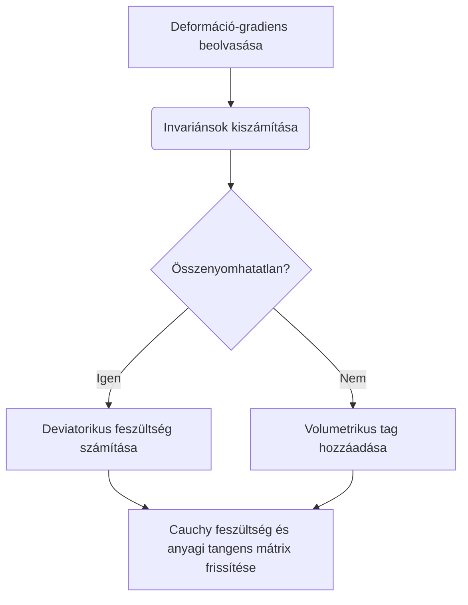

A modern mérnöki szimulációk során a nemlineáris anyagmodellek leírása kulcsfontosságú feladat.

### 1. Matematikai Háttér (LaTeX)

A hiperelasztikus anyagok esetében a feszültségek a $\Psi$ alakváltozási energiasűrűségi függvényből származtathatóak. Az $I_1$ és $I_2$ elsődleges nyúlási invariánsok függvényében a Neo-Hookean modell alap-egyenlete az alábbi formában írható fel:

$$
\Psi = \frac{\mu}{2}(I_1 - 3) + \frac{K}{2}(J - 1)^2
$$

Ahol $\mu$ a nyírási modulus, $K$ a kompressziós modulus, $J$ pedig a térfogatváltozást leíró invariáns. Ha $J=1$, akkor az anyag teljesen összenyomhatatlan, így a Cauchy-féle feszültségtensor ($\sigma$) tagjai egyszerűsödnek.

### 2. Algoritmikus Folyamat (Mermaid Diagram)

A konstitív modellek numerikus integrálása az alábbi lépések szerint történik a végeselem szoftverek anyagi alrutinjaiban (UMAT/VUMAT):

